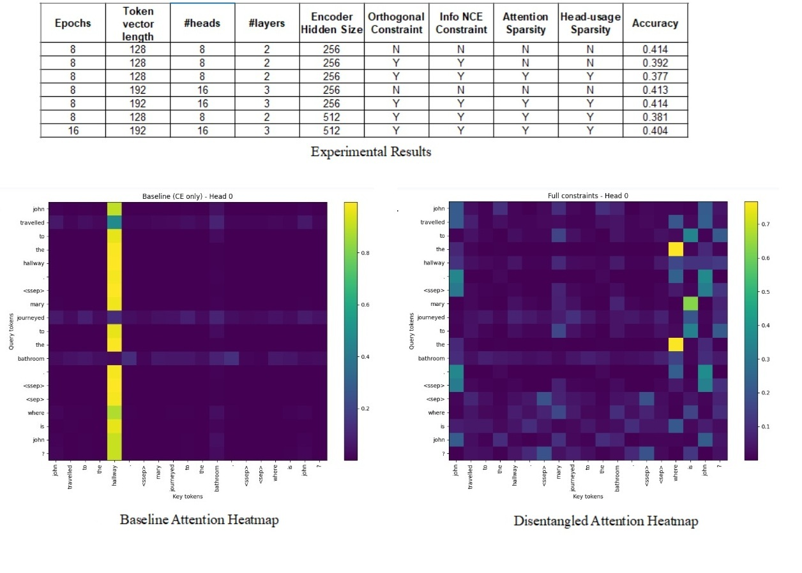

# Overview

This repository contains a clean, refactored PyTorch implementation of the original research code. The codebase was reorganized in **December 2025** to improve readability, modularity, and experimental clarity.

The project investigates the impact of **disentanglement constraints** on Transformer-based models, with a focus on **interpretability and reasoning performance**. Across experiments, we observe a consistent trend: introducing explicit disentanglement constraints often **degrades task performance** and requires **additional model capacity and training effort** to compensate.

# Key Findings

- **Disentanglement constraints do not reliably improve interpretability.**  
  Analysis of self-attention heatmaps shows that these constraints do not consistently yield semantically meaningful or correct attention patterns.

- **Performance degradation is a general trend.**  
  Adding disentanglement regularization typically reduces accuracy unless offset by increased model size or depth.

- **Sparse attention is not necessarily correct attention.**  
  Visualizations of self-attention heatmaps from randomly selected heads indicate that, while attention distributions become sparser under certain constraints, they often focus on *irrelevant or incorrect tokens* rather than meaningful relational structures.

---

# What Helps Boost Performance Under Disentanglement Constraints

1. **Increase the feed-forward network (FFN) hidden dimension**  
   Orthogonality and mutual-information proxy losses reduce effective representational capacity by restricting overlap among attention heads. Increasing the FFN hidden dimension compensates for this reduction by providing greater nonlinear expressive power within each Transformer encoder block.

2. **Increase the token representation dimension (`d_model`)**  
   - `d_model` determines the dimensionality of token embeddings and directly controls expressive capacity, attention head width, and overall parameter count.  
   - Because residual connections propagate `d_model`-dimensional representations across layers, a larger `d_model` allows more information to survive through depth, improving performance under disentanglement constraints.

3. **Increase the number of layers**  
   Without orthogonality or mutual-information constraints, attention heads often develop redundant representations across layers. Enforcing these constraints reduces redundancy by encouraging non-overlapping head subspaces. Deeper Transformer stacks can then perform compositional reasoning via successive relational abstractions.

4. **Increase the number of attention heads**  
   - Disentanglement explicitly promotes division of labor across heads; more heads provide additional slots for specialization.  
   - Under mutual-information and orthogonality constraints, additional heads reduce pressure on individual heads to encode multiple relations simultaneously.

---

# Why Disentanglement Constraints Hurt Reasoning Performance

## Orthogonality Loss and InfoNCE-Based Mutual Information Minimization

These constraints can be counterproductive in reasoning scenarios where multiple attention heads must legitimately rely on the same entity for different functional roles. For example, one head may bind a pronoun to its referent, while another simultaneously binds two entities to form a relational representation. Mutual information minimization discourages such heads from attending to the same entity, suppressing valid and complementary representations.

## Attention Entropy Sparsity Loss

Certain reasoning tasks require **diffuse attention** rather than sharply focused distributions. For instance, answering a question such as *“What is the ratio of boys to girls in the room?”* requires aggregating information across many tokens. Enforcing overly sparse attention can therefore degrade performance. Additionally, highly peaked softmax distributions may exacerbate vanishing gradient issues during training.

## Head-Usage Sparsity Loss

This constraint reduces the entropy of attention head usage by penalizing heads that are infrequently active across samples and tokens, causing them to gradually become inactive. However, the importance of an attention head is inherently **context-dependent**: a head that appears rarely used in aggregate may still be critical for specific inputs or reasoning patterns.

---

# Conclusion

Constraint-based disentanglement alone neither reliably improves interpretability nor preserves task performance. These findings suggest that **explicit regularization is insufficient** for achieving meaningful disentanglement in reasoning-oriented Transformer models.

Future work should therefore explore **non-constraint-based disentanglement approaches**, including:

- **Routing-based architectures**, in which input tokens dynamically select appropriate computation pathways; and  
- **Modern Hopfield associative memory mechanisms**, where similar inputs converge to shared memory attractors while distinct underlying factors naturally separate.
